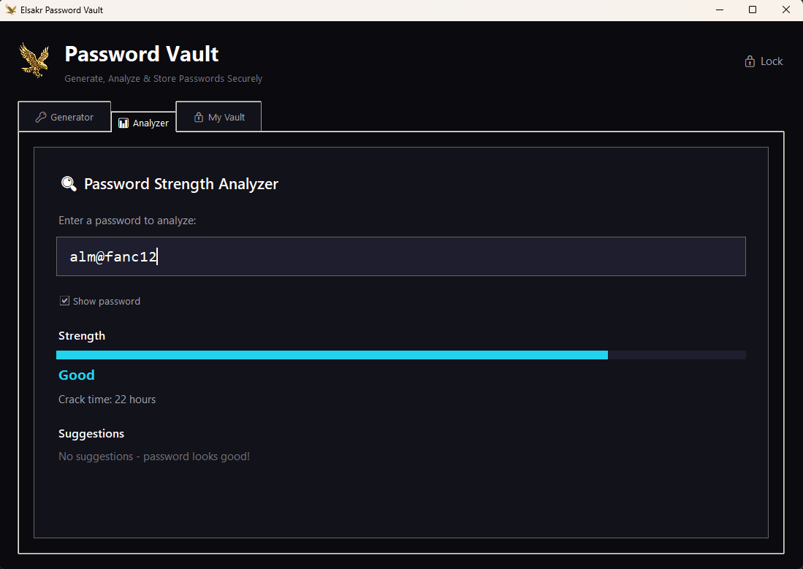

# 🦅 Elsakr Password Vault

[](https://elsakr.company)
[](https://elsakr.company)
[](LICENSE)


## Overview
Part of the **Elsakr Open Source Tools Ecosystem** — global proactive solutions for developers, designers, and marketers.
> **[View All Tools](https://elsakr.company/tools)**

**Generate. Analyze. Protect. Your password shouldn't be "password123".**
An all-in-one security tool designed to manage your digital safety. Generate cryptographically strong passwords, analyze existing ones for weaknesses, and securely store credentials.

## 🚀 Features
- 🔹 **Strong Generator**: Create complex passwords with custom rules.
- 🔹 **Strength Analyzer**: Visual feedback on crackability.
- 🔹 **Secure Vault**: AES-256 Encrypted storage.
- 🔹 **Local First**: Your database never leaves your device.

## 📸 Screenshots / Demo


## 📦 Getting Started

### 💻 Installation
Download the latest release or clone the repo:
```bash
git clone https://github.com/khalidsakrjoker/Elsakr-Password-Vault.git
```

### ▶️ Usage
1. **Setup**: Create a strong master password on first launch.
2. **Generate**: Use the Generator tab to create new credentials.
3. **Store**: Save them to the Vault tab.
4. **Analyze**: Check existing passwords for weaknesses.

## 🤝 Contributing
Security improvements are welcome and appreciated.

## 📝 License
This project is licensed under the MIT License.

## ⭐ Signature
**Elsakr** — *Open Source Tools with a Falcon’s Vision.*  
[elsakr.company](https://elsakr.company)

---

# 🇪🇬 النسخة العربية (Arabic Version)

## 🦅 خزنة كلمات المرور (Password Vault)
أداة أمان شاملة. بتولد باسووردات قوية، بتحلل الباسووردات القديمة، وبتحفظ بياناتك في خزنة مشفرة محلياً على جهازك.
